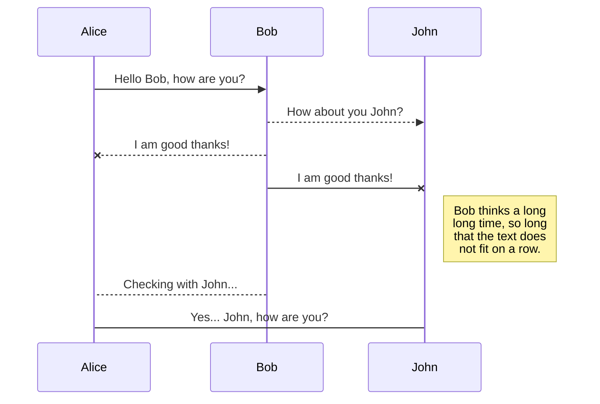
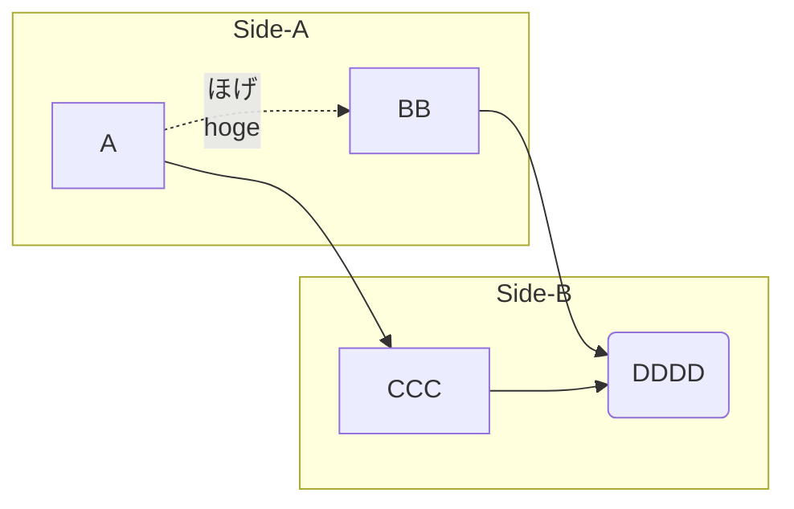

# Gitbook docs template

[](https://circleci.com/gh/TakuyaHarayama/gitbook-docs-template)

<!-- toc -->


## What is it?
An boilerplate for writing technical documentation on local [Gitbook](https://www.gitbook.com). 

- Work on local with [Gitbook-cli](https://github.com/GitbookIO/gitbook-cli) and your repository. Private repository also yes.
- Install gitbook/gitbook-cli as a project dependency. No use globally.
- Some of the Gitbook plugins that are useful for writing technical documents is installed.

Tested on macOS.


## Installed plugins
Following plugins is installed.

- [gitbook-plugin-toc](https://github.com/whzhyh/gitbook-plugin-toc)
- [gitbook-plugin-uml](https://plugins.gitbook.com/plugin/uml)
- [gitbook-plugin-mermaid-gb3](https://plugins.gitbook.com/plugin/mermaid-gb3)
- [gitbook-plugin-graph](https://github.com/cjam/gitbook-plugin-graph)
- [gitbook-plugin-theme-api](https://github.com/GitbookIO/theme-api)
- [gitbook-plugin-include-csv](https://github.com/TakuroFukamizu/gitbook-plugin-include-csv)

## Get started

Default `docs` to your book's name. and run it.

```bash
export PJNAME=docs && git clone --depth 1 https://github.com/TakuyaHarayama/gitbook-docs-template.git docs && cd docs && npm install && rm -fr .git && npm run serve
```

open [http://localhost:4000](http://localhost:4000)


### Additional requirements

#### gitbook-plugin-uml
If you need uml plugin. you need following steps.

Step 1. [Install PlantUML.](http://plantuml.com/download) (Download plantuml.jar to root path)

Step 2. Install graphviz package.

```bash
$ brew install graphviz
```

## Usage

```bash
# gitbook init
$ npm run init

# gitbook install
$ npm run install

# gitbook serve
$ npm run serve

# gitbook build
$ npm run build
```


## Plugins Usage

### gitbook-plugin-mermaid-gb3






### gitbook-plugin-uml

```uml
@startuml

    Class Stage
    Class Timeout {
        +constructor:function(cfg)
        +timeout:function(ctx)
        +overdue:function(ctx)
        +stage: Stage
    }
     Stage <|-- Timeout

@enduml
```

```uml
@startuml
testdot
@enduml
```

### gitbook-plugin-graph


    {
        "title":"cos(2*PI*x/2)*(1+0.5cos(2*PI*x/100))",     
        "grid":true,
        "xAxis": {
            "label":"Sample",
            "domain": [0,300]
        },
        "yAxis": {
            "label":"Amplitude",
            "domain": [-1.5,1.5]
        },
        "data": [
            { "fn": "cos(2*PI*x/2)*(1+0.5cos(2*PI*x/100))"},         
            { "fn": "(1+0.5cos(2*PI*x/100))"}
        ]
    }



### theme-api


How to install GitBook API client.


```bash
$curl -X GET https://api.keion.com/v1/members \
     -H "Content-Type: application/json" \
     -d @- << EOF
     {
       "access_token": "59xxxxxxxxxxxxxxxxxxxxxxxxxx",
       "space_id": "59xxxxxxxxxxxxxxxxxxxxxxxxxx",
       "limit": 1
     }
EOF
```

**Example Response**

```json
{
  "data": {
    "members": [
      {
        "id": "1",
        "name": "Yui Hirasawa",
        "job": "guitar",
        "sex": "female",
        "age": "18"
      }
    ]
  }
}
```



### include-csv




## Linter

```bash
$ npm run -s lint
```

```bash
$ npm run -s lintfix
```

## Deploy to S3

**EXAMPLE CircleCI**

- Change `YOUR-PROJECT` to your project name
- Craete AWS S3 bucket `YOUR-PROJECT`-docs
- Set IAM KEYS to CircleCI environment variables

<script src="https://gist.github.com/TakuyaHarayama/447318ad453b3673f81feed4b7feaf75.js"></script>

## License

Released under the MIT license.
